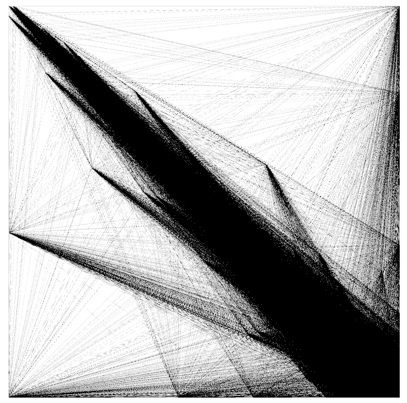

# Graph Portfolio

Repositório do projeto de construção de portfólios via teoria dos grafos.

## Instância de Grafo

O arquivo `correlacao_b3.graphml` contém o grafo de correlações construído
a partir dos dados históricos da B3 (2015–2025), com 919 vértices e 418.757 arestas.

## Dados

Os dados processados estão disponíveis no Google Drive: 
[https://drive.google.com/drive/folders/1hl2oRDWSet3amAiH90mK0hYVMCEqAnco?usp=sharing]    